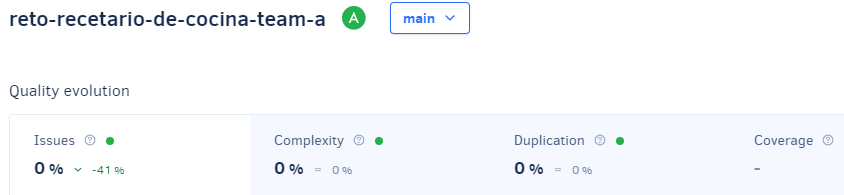
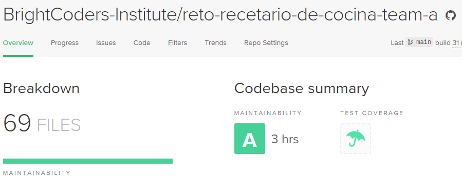
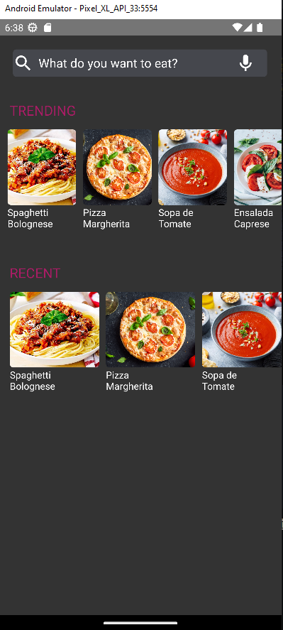
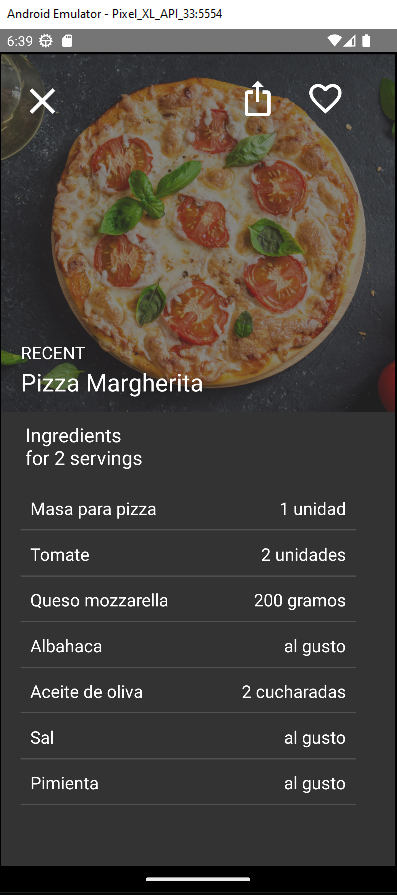

# App recetario de cocina

> [Ver instrucciones antes de iniciar](./instructions.md)

## Table of contents
- [Description](#description)
- [Intallation and Run](#intallation-and-run)
- [Usage](#usage)
- [Credits](#credits)
- [Badges](#badges)
- [App Screenshots](#app-screenshots)

## Description
"Recipe App" is a mobile application developed with React Native that provides a user-friendly platform for discovering, exploring, and cooking a wide variety of recipes. With a curated feed of recent and popular recipes, a powerful search feature, and detailed recipe pages showcasing serving portions and ingredients accurately, this app is perfect for those seeking culinary inspiration and wanting to expand their cooking skills. Whether you're looking for recipes for a special occasion or simply want to try something new in your daily routine, Recipe App offers all the necessary tools to become a culinary master in the comfort of your own home. Discover new ideas, organize your favorite recipes, and enjoy delicious dishes with this intuitive and user-friendly app!

## Installation and Run
- Clone this repo.
- Run `npm install` to install all dependencies.
- Run `npm react-native start` to start the server.
- Run `npm react-native run-android` to run the app on Android.
- Run `npm react-native run-ios` to run the app on iOS.

## Usage
To add new recipies, you can modify the file `src/data/recipes.js` and add a new one following the same structure as the others.
To check the recipes details you can click on the recipe card and it will take you to the details page.

## Credits
- [BrightCoders](http://www.brightcoders.com/)
- [Axw3ll](axelomar.a.v@gmail.com)
- [Antonio3veces3](aantonioramirez33@gmail.com)
- [Eduardoespl](eduardoesp3317@gmail.com)

## Badges
# Qualification with Codacy

# Qualification with Codeclimate

## App Screenshots

